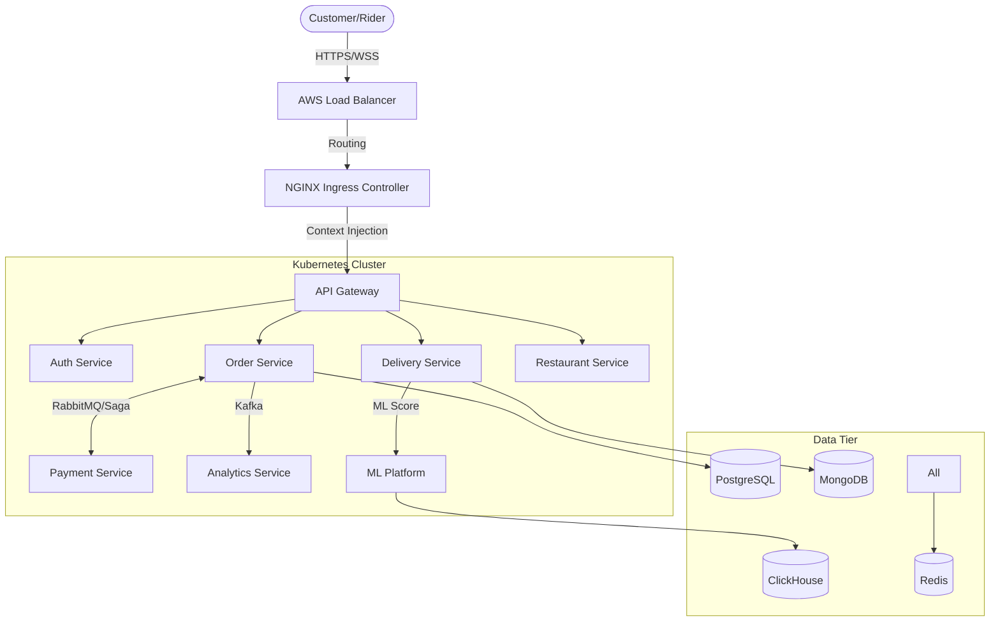
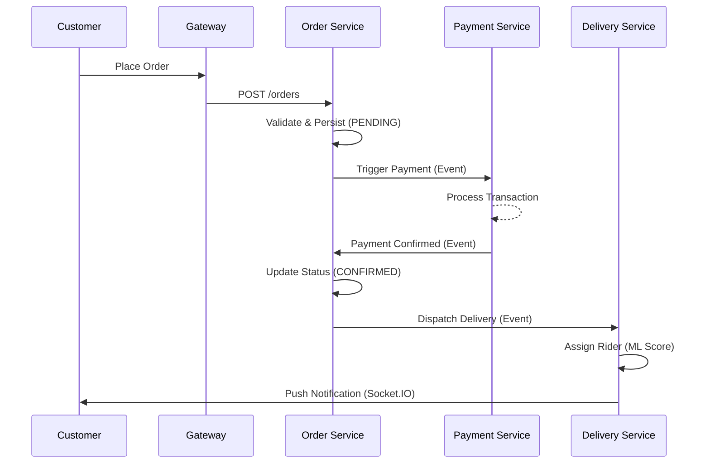

# FluxDrop: Enterprise Quick-Commerce & Delivery Infrastructure

> **This project belongs to Hani Kumar.**

FluxDrop is a production-grade, distributed, and multi-tenant delivery-as-a-service (DaaS) platform. Designed for hyper-local commerce at scale, FluxDrop powers the complete lifecycle of order fulfillment—from intelligent restaurant dispatching and real-time rider tracking to automated financial settlements and predictive analytics.

---

## 🚀 Key Features

- **Microservices Architecture:** 10+ isolated NestJS services for maximum scalability.
- **Intelligent Logistics:** ML-powered ETA prediction and rider dispatch optimization.
- **Real-Time Experience:** Socket.IO powered sub-second tracking for customers and admins.
- **Enterprise SaaS:** Multi-tenant isolation with automated Row-Level Security (RLS).
- **High Availability:** Hardened with Circuit Breakers, Rate Limiting, and Chaos Engineering.
- **Global Observability:** Centralized logging (Loki), metrics (Prometheus), and tracing (OpenTelemetry).

---

## 🏗️ System Architecture

### 1. High-Level Infrastructure
FluxDrop follows a **Cloud-Native, Event-Driven Architecture**:



### 2. Distributed Order Saga


---

## 🛠️ Technology Stack

| Category | Technologies |
| :--- | :--- |
| **Backend** | NestJS, TypeScript, Python (FastAPI), Prisma |
| **Mobile** | React Native, Expo, Zustand, React Query |
| **Frontend** | Next.js 14, Tailwind CSS, Lucide |
| **Databases** | PostgreSQL, MongoDB, ClickHouse |
| **Messaging** | Kafka, RabbitMQ, Redis Pub/Sub |
| **Infrastructure** | Docker, Kubernetes (K8s), Helm, Terraform |
| **CI/CD** | GitHub Actions, Expo EAS |
| **Observability** | Prometheus, Grafana, Loki, OpenTelemetry |

---

## 📂 Repository Structure

```text
fluxdrop-monorepo/
├── services/               # Microservices (NestJS & Python)
│   ├── auth-service/       # Identity & RBAC
│   ├── order-service/      # Distributed Saga Workflows
│   ├── delivery-service/   # Real-time Logistics & Tracking
│   ├── payment-service/    # Financial Settlements & Ledgers
│   ├── restaurant-service/ # Catalog & Kitchen Management
│   ├── analytics-service/  # Kafka-to-ClickHouse Ingestion
│   └── ml-platform/        # ETA & Optimization Engines (Python)
├── mobile/                 # Mobile Applications
│   ├── customer-app/       # Consumer Experience
│   └── rider-app/          # Logistics Execution
├── admin/                  # Operations & BI Platforms
│   ├── dashboard/          # Control Center (Live Ops)
│   └── analytics/          # Business Intelligence (Next.js)
├── libs/                   # Shared Infrastructure Libraries
│   ├── reliability/        # Circuit Breakers & Rate Limiting
│   └── saas/               # Multi-tenancy & Isolation
├── k8s/                    # Kubernetes Manifests & Helm Charts
└── .github/                # CI/CD Workflows
```

---

## 🚦 Getting Started

### Prerequisites
- Node.js v20+
- Python 3.11+
- Docker & Docker Compose
- Kubernetes (local via Minikube/Docker Desktop)

### Installation
1. **Clone the repo:**
   ```bash
   git clone https://github.com/your-org/fluxdrop.git
   cd fluxdrop-monorepo
   ```

2. **Install Dependencies:**
   ```bash
   npm install
   ```

3. **Spin up Infrastructure:**
   ```bash
   docker-compose up -d
   ```

4. **Initialize Databases:**
   ```bash
   npx turbo prisma:generate
   npx turbo prisma:deploy
   ```

5. **Run Development Services:**
   ```bash
   npm run dev
   ```

---

## 🛡️ Reliability & Security
FluxDrop is built with a **"Failure-First"** mindset:
- **Circuit Breakers:** Prevents cascading failures via Opossum interceptors.
- **Distributed Rate Limiting:** Redis-backed token bucket protection at the Gateway.
- **Tenant Isolation:** Automated Prisma extensions ensuring cross-tenant data security.
- **Chaos Mesh:** Scheduled failure injection in staging to verify recovery SLAs.

---

## 📈 Observability
Access the monitoring stack at:
- **Grafana:** `http://localhost:3000` (Dashboards)
- **Prometheus:** `http://localhost:9090` (Metrics)
- **Loki:** Centralized logging backend
- **Jaeger:** Distributed tracing explorer

---

## 👥 Authors

- **Hani Kumar** - *Lead Architect & Infrastructure Engineer*

---

## 📄 License
This project is licensed under the MIT License - see the [LICENSE](LICENSE) file for details.
