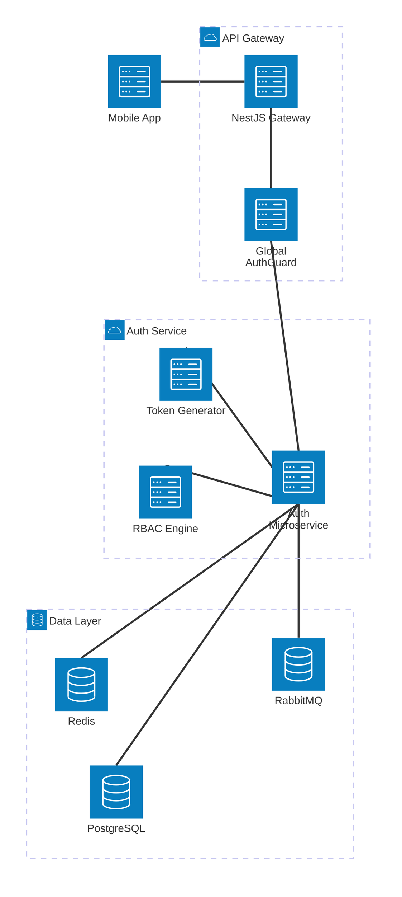

# FluxDrop Phase 3: Authentication & Identity Management Architecture

## 1. Complete Authentication Architecture

The identity system operates on a zero-trust model. The **API Gateway** acts as the stateless validation layer, while the **Auth Service** handles stateful token generation, session management, and cryptographic operations.



---

## 2. Prisma Schema Design (PostgreSQL)

The schema supports multiple sessions per user, device tracking, and role-based access control. We store the *hash* of the refresh token to prevent exposure if the database is compromised.

```prisma
datasource db {
  provider = "postgresql"
  url      = env("DATABASE_URL")
}

enum Role {
  CUSTOMER
  DELIVERY_PARTNER
  ADMIN
  RESTAURANT_OWNER
}

model User {
  id               String    @id @default(uuid())
  email            String    @unique
  passwordHash     String    // Hashed with Argon2id
  isEmailVerified  Boolean   @default(false)
  roles            Role[]    @default([CUSTOMER])
  sessions         Session[]
  createdAt        DateTime  @default(now())
  updatedAt        DateTime  @updatedAt
}

model Session {
  id               String    @id @default(uuid())
  userId           String
  user             User      @relation(fields: [userId], references: [id], onDelete: Cascade)
  refreshTokenHash String    // Hashed opaque token
  familyId         String    // Used for Refresh Token Reuse Detection
  deviceInfo       String?   // User-Agent or Device ID
  ipAddress        String?
  isRevoked        Boolean   @default(false)
  expiresAt        DateTime
  createdAt        DateTime  @default(now())
  
  @@index([userId])
}
```

---

## 3. Auth Service Folder Structure

```text
apps/auth-service/src/
├── auth/
│   ├── controllers/
│   │   ├── auth.controller.ts        # Login, Register, Logout
│   │   └── token.controller.ts       # Refresh Token Rotation
│   ├── services/
│   │   ├── auth.service.ts           # Core business logic
│   │   ├── password.service.ts       # Argon2 wrapper
│   │   ├── session.service.ts        # Prisma DB Session management
│   │   └── otp.service.ts            # Redis OTP management
│   ├── strategies/
│   │   └── jwt.strategy.ts           # Passport JWT Strategy definition
│   ├── guards/
│   │   ├── jwt-auth.guard.ts         # Local microservice protection
│   │   └── role.guard.ts             # RBAC evaluations
│   ├── dtos/
│   │   ├── register.dto.ts           # class-validator schemas
│   │   └── login.dto.ts
│   └── events/
│       └── auth-event.publisher.ts   # Emits to RabbitMQ
├── main.ts                           # Microservice bootstrap
└── auth.module.ts
```

---

## 4. JWT Strategy & 5. Access vs Refresh Token Architecture

We utilize an asymmetric key pair (RS256) for token signing. 
*   **Access Token (JWT, 15m TTL)**: Signed by Auth Service using the Private Key. API Gateway verifies it statelessly using the Public Key. Contains `{ sub: userId, roles: ['CUSTOMER'] }`.
*   **Refresh Token (Opaque String, 7d TTL)**: A cryptographically secure random string (e.g., `crypto.randomBytes(64)`). We never use JWTs for refresh tokens to prevent token bloat and enable instant revocation.

---

## 6. Redis Session Flow

Redis acts as a high-speed ephemeral store for security operations:
1.  **Token Blacklisting**: If a user logs out, their valid Access Token `jti` (JWT ID) is pushed to Redis with a TTL equal to the token's remaining lifespan. The API Gateway checks this cache.
2.  **OTP Storage**: Email/Phone Verification OTPs are stored here as `otp:{userId}:{action}` with a 5-minute TTL.
3.  **Rate Limiting Counters**: Tracks failed login attempts via `login_fails:{ip}`. If count > 5, IP is blocked for 15 minutes.

---

## 7. RBAC (Role-Based Access Control) Architecture

Implemented via NestJS Custom Decorators and Guards.

```typescript
// @fluxdrop/shared-utils
export const Roles = (...roles: Role[]) => SetMetadata('roles', roles);

// Gateway Controller Example
@UseGuards(JwtAuthGuard, RolesGuard)
@Roles(Role.RESTAURANT_OWNER, Role.ADMIN)
@Post('/restaurant/menu')
createMenu(@Req() req, @Body() dto: CreateMenuDto) { ... }
```

---

## 8. API Gateway Auth Middleware

The API Gateway intercepts all inbound HTTP traffic.
1. Extracts Bearer token from `Authorization` header.
2. Verifies RS256 signature using Public Key.
3. Checks if token `jti` exists in Redis Blacklist.
4. If valid, strips headers and injects `X-User-Id` and `X-User-Roles` into the TCP payload sent to internal microservices.

---

## 9. Event-Driven Auth Communication (RabbitMQ)

Auth Service publishes events to the `fluxdrop.events` topic exchange.

*   `auth.user.created`: User Profile Service creates a default profile. Notification Service sends a "Welcome" email.
*   `auth.user.logged_in`: Notification Service sends a "New Login from Device X" alert if a new IP is detected.
*   `auth.password.reset_requested`: Notification Service listens and emails the password reset OTP.

---

## 10. Secure Login Flow

1.  Client POSTs `{ email, password, deviceId }`.
2.  Auth Service fetches User, verifies password with `argon2.verify()`.
3.  Checks Redis rate limiter for brute-force attempts.
4.  Generates Access Token (JWT).
5.  Generates Refresh Token (Opaque). Hashes Refresh Token and saves to PostgreSQL `Session` table with `deviceId` and `ipAddress`.
6.  Emits `auth.user.logged_in` to RabbitMQ.
7.  Returns tokens to the client.

---

## 11. Refresh Token Rotation & Reuse Detection

To prevent stolen refresh tokens from being used indefinitely, we implement **Refresh Token Rotation with Reuse Detection**:

1.  Client sends `refreshToken` to `/auth/refresh`.
2.  Auth Service hashes it and finds the `Session` in PostgreSQL.
3.  **If `isRevoked` is true (Reuse Detection)**: Someone is trying to use an old, rotated token. This implies a token leak. The system immediately revokes *all* sessions belonging to that `familyId` (Device) and alerts the user.
4.  If valid, the system marks the current `Session` as `isRevoked: true`, generates a *new* Refresh Token with the same `familyId`, generates a new Access Token, and returns both to the client.

---

## 12. Logout & Token Revocation Flow

1.  Client sends POST `/auth/logout` with `refreshToken`.
2.  Auth Service hashes the `refreshToken` and deletes/marks the PostgreSQL `Session` as revoked.
3.  Auth Service extracts the `jti` from the current Access Token and adds it to the Redis Blacklist until its expiration time.
4.  Emits `auth.user.logged_out`.

---

## 13. DTO Validation Structure

Strict payload validation at the controller boundary.

```typescript
import { IsEmail, IsString, MinLength, Matches } from 'class-validator';

export class RegisterDto {
  @IsEmail({}, { message: 'Invalid email format' })
  email: string;

  @IsString()
  @MinLength(8)
  @Matches(/(?=.*[A-Z])(?=.*[0-9])/, { message: 'Password must contain uppercase and number' })
  password: string;

  @IsString()
  deviceInfo: string;
}
```

---

## 14. Exception Handling Strategy

All authentication failures (Wrong password, missing token, revoked token) must throw generic errors to prevent enumeration attacks.
*   **Wrong Password**: Throws `UnauthorizedException("Invalid credentials")` (Never "Password incorrect").
*   **Account Not Found**: Throws `UnauthorizedException("Invalid credentials")`.
*   **Token Expired**: Throws standard 401 with `{ errorCode: 'TOKEN_EXPIRED' }` so the frontend knows to trigger the silent refresh flow.

---

## 15. Production-Grade Security Best Practices

1.  **Argon2id Hashing**: Adopted over bcrypt for superior resistance to GPU cracking and side-channel attacks.
2.  **Helmet & CORS**: The API Gateway uses `helmet()` to set strict HTTP headers (HSTS, NoSniff). CORS is tightly restricted to the mobile app schema and internal dashboards.
3.  **Socket.IO Authentication**: WebSocket connections must pass the JWT in the initial handshake `auth` payload. The gateway disconnects any socket without a valid token immediately.
4.  **No JWTs in LocalStorage**: The React Native client will be instructed to store the Access/Refresh tokens in `SecureStore` (iOS Keychain / Android Keystore) to prevent XSS exfiltration.
5.  **PII Segregation**: The Auth Service only stores Email and Password. Names, Phone Numbers, and Addresses are strictly maintained by the User Service to minimize blast radius in the event of a breach.
