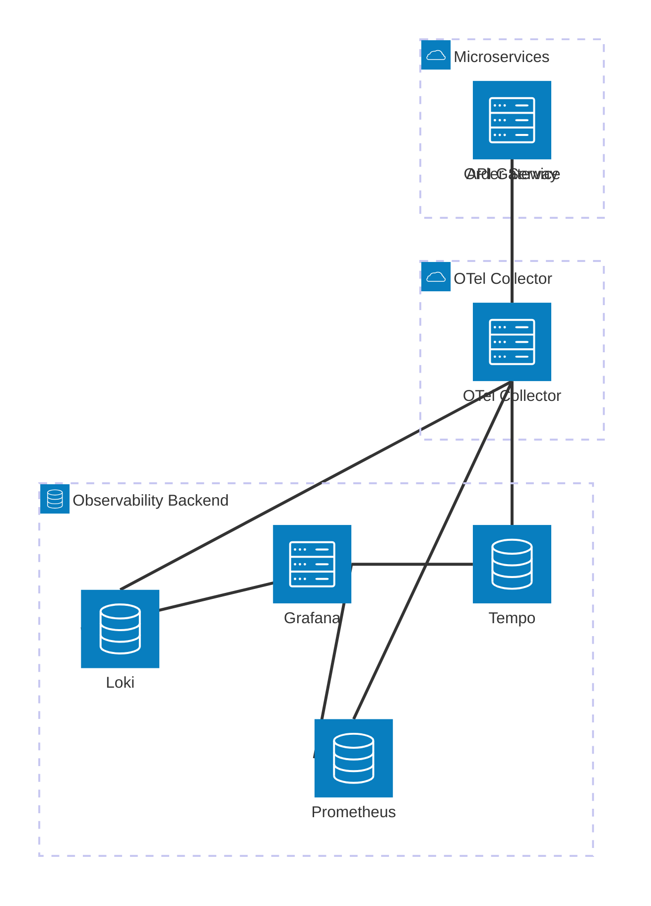

# FluxDrop Phase 8: Notification Infrastructure & Observability Platform

## 1. Complete Notification Service Architecture & 2. Multi-Channel Messaging

The **Notification Service** operates as a massive event sink. It listens to domain events across the RabbitMQ topology (`fluxdrop.events` exchange) and translates them into localized, user-friendly communications. It employs a **Provider Abstraction Pattern** to prevent vendor lock-in.

1.  **Consumer Layer**: Listens to RabbitMQ events (`order.delivered`, `payment.failed`, `auth.otp_requested`).
2.  **Routing Layer**: Checks User `notification_preferences` in PostgreSQL. Decides the delivery channel (Push, SMS, Email, In-App, or all).
3.  **Template Engine**: Compiles Handlebars/Pug templates injected with event payloads.
4.  **Dispatcher**: Uses BullMQ (Redis-backed) to queue the external API calls (FCM, Twilio, SendGrid), ensuring we don't exceed 3rd-party rate limits.

---

## 3. FCM Push Architecture (Firebase)

Push notifications are critical for delivery updates. Users often have multiple devices (e.g., iPhone and iPad).

*   **Token Management**: When the Mobile App boots, it sends its FCM Token to the API. The Notification Service stores this in the `device_tokens` PostgreSQL table linked to the `userId`.
*   **Targeting**: `sendToDevice` (single), `sendToUser` (loops through all active tokens for a user), or `sendToTopic` (e.g., broadcasting to `topic:delhi_riders` for rain alerts).
*   **Invalidation**: If FCM returns `UNREGISTERED` or `NotRegistered`, the service immediately deletes the token from Postgres to prevent dead-letter loops.

---

## 4. Email & SMS Provider Abstraction Architecture

We strictly implement the **Strategy Pattern** for external communication.

```typescript
// Abstract Strategy
interface ISmsProvider {
  sendSms(phone: string, message: string): Promise<boolean>;
}

// Concrete Implementations
class TwilioSmsProvider implements ISmsProvider { ... }
class AwsSnsSmsProvider implements ISmsProvider { ... }

// Factory
@Injectable()
export class SmsService {
  constructor(private provider: ISmsProvider) {}
  // ...
}
```
This allows hot-swapping providers if Twilio goes down, simply by changing an environment variable (`SMS_PROVIDER=AWS_SNS`).

---

## 5. Retry, Dead-Letter Queue (DLQ) & Throttling Strategy

*   **Throttling**: Promotional notifications are rate-limited via Redis to max 1 per user per day.
*   **Retries**: BullMQ handles external API failures. If SendGrid returns a 503, the job is rescheduled using exponential backoff (1s, 5s, 25s).
*   **DLQ**: If a notification fails 5 times, it is moved to the `notifications_dlq`. If it was an OTP, we trigger a fallback (e.g., failed SMS -> trigger Email). If it's non-critical, it is dropped.

---

## 6. Notification Event Workflows

1.  **Transactional**: `order.created` -> Push + In-App.
2.  **Authentication**: `password.reset_requested` -> Highest Priority Queue -> Email.
3.  **Operational**: `rider.assigned` -> Push + Socket.IO live trigger.
4.  **Alerting**: `payment.failed` -> In-App + Email.

---

## 7. In-App Notification & 14. Socket.IO Scaling Architecture

*   **Persistence**: Stored in PostgreSQL `notifications` table (`isRead: false`).
*   **Delivery**: As the record is saved, the service emits via the Redis-backed Socket.IO adapter to `room:user:{userId}`.
*   **UI Experience**: The app receives the socket event, updates the unread badge count instantly, and shows a toast.

---

## 8. Observability Platform Design

We deploy a modern cloud-native observability stack (The LGTM Stack: Loki, Grafana, Tempo/Trace, Prometheus) using **OpenTelemetry (OTel)**.



---

## 9. Distributed Tracing Architecture (OpenTelemetry & Tempo)

A single user checkout request touches API Gateway -> Auth -> Order -> Restaurant -> Payment. 
*   **Correlation IDs**: The API Gateway generates an OpenTelemetry `trace-id`. 
*   **Propagation**: This ID is automatically injected into HTTP headers (W3C Trace Context) and RabbitMQ message headers.
*   **Visualization**: In Grafana (Tempo), engineers can type a `trace-id` and see a waterfall Gantt chart of exactly how many milliseconds each microservice took, pinpointing the bottleneck.

---

## 10. Logging Aggregation Strategy (Loki & Pino)

*   **Structured Logging**: NestJS uses `nestjs-pino`. Logs are exclusively emitted as JSON.
*   **Contextual Logging**: Every log automatically includes `trace_id`, `service_name`, and `env`.
*   **Loki**: The OTel Collector forwards these JSON logs to Grafana Loki. Loki indexes only the labels (service, level) and compresses the JSON text, making it extremely cost-effective compared to ELK.

---

## 11. Prometheus Monitoring & 12. Metrics Collection

NestJS is instrumented with `@willsoto/nestjs-prometheus`.
**Custom Metrics Collected:**
*   `http_requests_total` (Counter)
*   `http_request_duration_seconds` (Histogram)
*   `rabbitmq_queue_depth` (Gauge)
*   `order_processing_time_seconds` (Histogram)
*   `active_websocket_connections` (Gauge)

Prometheus scrapes the `/metrics` endpoint of every microservice every 15 seconds.

---

## 13. Alerting System Design

Alerts are defined via **PromQL** rules evaluated by Prometheus Alertmanager, which routes critical alerts to PagerDuty/Slack.

**Critical Alerts:**
*   **Gateway 5xx Spike**: `rate(http_requests_total{status=~"5.."}[5m]) > 5`
*   **DLQ Backlog**: `rabbitmq_queue_depth{queue="failed_orders_dlq"} > 10`
*   **Payment Failure Anomaly**: `rate(payment_completed_total[10m]) < 50% of expected baseline`
*   **High Latency**: `histogram_quantile(0.95, rate(http_request_duration_seconds_bucket[5m])) > 1.5s`

---

## 15. Production-Grade Reliability Engineering Practices

1.  **Log Scrubbing**: PII (Emails, Phone numbers) and PCI (Card hints) are actively scrubbed via a Pino redaction interceptor *before* leaving the Node process, ensuring logs are GDPR compliant.
2.  **Graceful Degradation**: If the Notification Service crashes, the Order Service continues processing orders. RabbitMQ will queue the `order.created` events until the Notification Service reboots. Notifications will be slightly delayed, but revenue is never blocked.
3.  **Circuit Breakers on Providers**: If FCM or Twilio goes down, a Circuit Breaker (using `opossum` library) trips after 10 failures. This stops us from hammering a dead API, instantly routes messages to the fallback provider or DLQ, and allows the third-party service time to recover.
4.  **Health Probes vs Metrics**: Kubernetes uses lightweight `/health` endpoints to restart dead pods. Prometheus uses the heavier `/metrics` endpoint to plot trends. We strictly separate these to prevent monitoring overhead from affecting pod stability.
