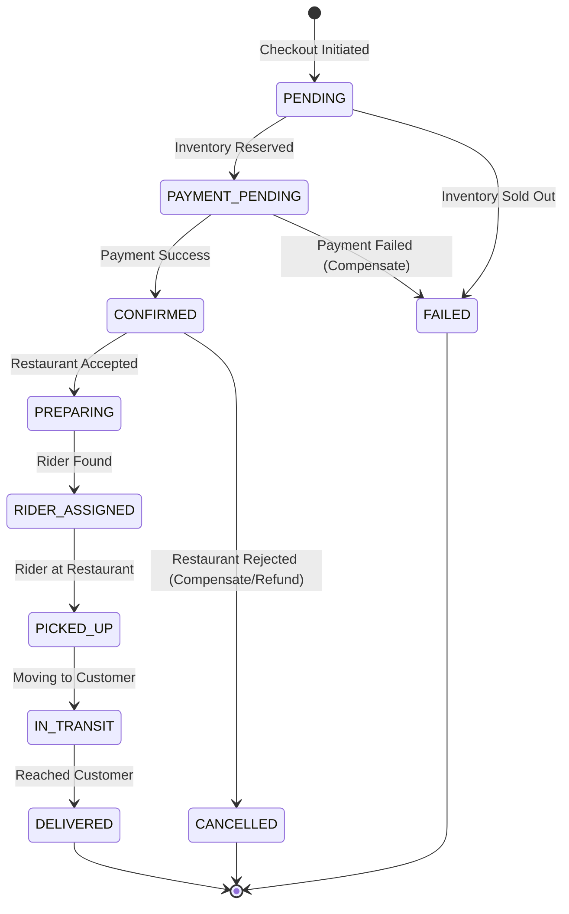

# FluxDrop Phase 5: Order Management & Distributed Saga Architecture

## 1. Complete Order Service Architecture Overview

The **Order Service** acts as the central brain of the commerce platform. Given the high stakes of financial transactions and physical fulfillment, we use an **Orchestration-Based Saga Architecture**. Instead of letting services react to each other blindly (Choreography), the Order Service maintains a strict state machine and issues commands to the Restaurant, Payment, and Delivery services, listening for their specific success/failure reply events.

---

## 2. Distributed Saga Pattern & 3. Transaction Flow

**The Golden Path (Success Flow):**
1. **API Gateway**: Receives `POST /orders/checkout` with `Idempotency-Key`.
2. **Order Service (Orchestrator)**: Creates Order as `PENDING`.
3. **Command**: Order Service emits `inventory.reserve_cmd` to Restaurant Service.
4. **Reply**: Restaurant Service replies `inventory.reserved`.
5. **State Update**: Order changes to `PAYMENT_PENDING`.
6. **Command**: Order Service emits `payment.process_cmd` to Payment Service.
7. **Reply**: Payment Service replies `payment.completed`.
8. **State Update**: Order changes to `CONFIRMED`.
9. **Event**: Emits `order.confirmed` (triggers Restaurant tablet to start `PREPARING` and Delivery Service to start `rider.assignment_requested`).

---

## 4. Compensation Transaction Design (Failure Recovery)

If a step fails, the Orchestrator executes compensation commands in reverse to undo partial transactions.

**Failure Scenario: Payment Fails but Inventory was Reserved**
1. **Reply**: Payment Service replies `payment.failed` (e.g., card declined).
2. **State Update**: Order changes to `FAILED`.
3. **Compensation Command**: Order Service emits `inventory.release_cmd` to Restaurant Service.
4. **Reply**: Restaurant Service replies `inventory.released`.
5. **Completion**: Distributed transaction cleanly aborted.

---

## 5. Order State Machine



---

## 6. Prisma Schema Structure (PostgreSQL)

Implements the **Transactional Outbox Pattern** (`OutboxEvent` table) to ensure saving the order to the database and emitting a RabbitMQ event are completely atomic operations.

```prisma
datasource db {
  provider = "postgresql"
  url      = env("DATABASE_URL")
}

enum OrderState {
  PENDING
  PAYMENT_PENDING
  CONFIRMED
  PREPARING
  RIDER_ASSIGNED
  PICKED_UP
  IN_TRANSIT
  DELIVERED
  CANCELLED
  FAILED
}

model Order {
  id              String               @id @default(uuid())
  userId          String
  restaurantId    String
  status          OrderState           @default(PENDING)
  totalAmount     Decimal              @db.Decimal(10, 2)
  deliveryFee     Decimal              @db.Decimal(10, 2)
  taxes           Decimal              @db.Decimal(10, 2)
  idempotencyKey  String               @unique // Duplicate protection
  
  items           OrderItem[]
  statusHistory   OrderStatusHistory[]
  
  createdAt       DateTime             @default(now())
  updatedAt       DateTime             @updatedAt
  
  @@index([userId, status])
  @@index([restaurantId, status])
}

model OrderItem {
  id              String   @id @default(uuid())
  orderId         String
  order           Order    @relation(fields: [orderId], references: [id])
  menuItemId      String
  name            String   // Snapshot to prevent price changes affecting old orders
  quantity        Int
  unitPrice       Decimal  @db.Decimal(10, 2)
  variants        Json?    // E.g., { "size": "large", "crust": "thin" }
}

model OrderStatusHistory {
  id              String     @id @default(uuid())
  orderId         String
  order           Order      @relation(fields: [orderId], references: [id])
  status          OrderState
  reason          String?    // E.g., "Card declined by bank"
  createdAt       DateTime   @default(now())
}

model OutboxEvent {
  id              String   @id @default(uuid())
  aggregateId     String   // Order ID
  eventType       String   // e.g., 'order.confirmed'
  payload         Json
  published       Boolean  @default(false)
  createdAt       DateTime @default(now())
}
```

---

## 7. Redis Locking & Idempotency Strategy

**Duplicate Request Prevention:**
Mobile networks are flaky. If a user double-taps "Checkout", we must prevent creating two identical orders and double-charging them.
1. The App generates an `Idempotency-Key` (UUID) upon opening the checkout screen.
2. Order Service attempts to `SETNX idempotency:{userId}:{key} "processing"` in Redis.
3. If it fails (key exists), we block the request.
4. If successful, we process the order, map it in Postgres, and update Redis to `SET idempotency:{userId}:{key} {orderId}`. 

**Distributed Locks (Redlock):**
Used when updating a single order state from multiple asynchronous RabbitMQ events to prevent race conditions (e.g., Rider arrives EXACTLY when the restaurant hits "Order Ready").

---

## 8. Cart Architecture

Carts are highly ephemeral and updated constantly as users tweak quantities.
*   **Storage**: Strict Redis-only storage. We NEVER save carts to PostgreSQL until the user initiates checkout.
*   **Structure**: `Hash` type in Redis `cart:{userId}` -> `{ "restaurantId": "...", "items": [...] }`.
*   **TTL**: 7 Days.

---

## 9. Real-Time Order Tracking Flow & 13. Socket.IO Architecture

Socket.IO is managed by the Notification Service, but the Order Service drives the updates.

1.  **Rooms Strategy**: 
    *   Customer joins: `room:order:{orderId}`
    *   Restaurant Tablet joins: `room:restaurant:{restaurantId}`
2.  **Flow**: Order Service changes state in Postgres -> Emits `order.state_changed` to RabbitMQ -> Notification Service consumes it -> Emits via WebSocket to `room:order:{orderId}`.
3.  **Result**: The user's mobile app instantly animates the tracker from "Preparing" to "Picked Up".

---

## 10. Failure Recovery & 11. Dead-Letter Queue Strategy

In a distributed system, network calls *will* fail.

1.  **Exponential Backoff**: If the Payment Service is down, the RabbitMQ consumer uses NestJS retry strategies (retrying at 1s, 2s, 4s, 8s intervals).
2.  **Dead-Letter Exchanges (DLX)**: If a message fails 5 times, it is routed to a `fluxdrop.dlx` exchange and lands in a `failed_orders_dlq` queue.
3.  **Admin Intervention**: An Admin Dashboard monitors the DLQ. Engineers can manually replay these messages or force-fail the order and refund the user.

---

## 12. Transactional Outbox Pattern Details

To ensure we never save an `Order` to Postgres but fail to emit `order.created` to RabbitMQ (which would leave the order in limbo forever):
1. We start a Postgres `$transaction`.
2. Save the `Order`.
3. Save the event data to the `OutboxEvent` table.
4. Commit the transaction.
5. A background worker (or CDC tool like Debezium) polls the `OutboxEvent` table and safely publishes to RabbitMQ, marking it `published: true`.

---

## 14. API Route Structure

**Customer APIs:**
*   `POST /api/v1/orders` (Requires `Idempotency-Key` header)
*   `GET /api/v1/orders?page=1` (History)
*   `GET /api/v1/orders/:id`
*   `POST /api/v1/orders/:id/cancel` (Only allowed if status == `PENDING` or `CONFIRMED` depending on business logic)

**Restaurant APIs (Tablet):**
*   `GET /api/v1/owner/orders/active`
*   `PATCH /api/v1/owner/orders/:id/accept`
*   `PATCH /api/v1/owner/orders/:id/ready`

**Admin APIs:**
*   `POST /api/v1/admin/orders/:id/force-cancel`
*   `GET /api/v1/admin/queues/dlq` (Monitor dead-letters)

---

## 15. Production-Grade Scalability Patterns

1.  **Database Snapshotting**: The `OrderItem` table stores the `name`, `unitPrice`, and `variants` directly. We NEVER use a foreign key JOIN to fetch the price of an order item from the Restaurant Service. If a restaurant changes a burger price tomorrow, yesterday's order receipts remain mathematically intact.
2.  **Saga Timeout Queues**: Using RabbitMQ delayed message exchanges, if an order is stuck in `PAYMENT_PENDING` for > 10 minutes, a timeout event fires, automatically compensating (releasing inventory) and marking the order as `FAILED`.
3.  **Read Heavy/Write Heavy Separation**: The Redis Cart is designed for high write velocity. The Postgres Order tables are designed for strict ACID transaction writes, while Order History reads can be offloaded to Read Replicas.
